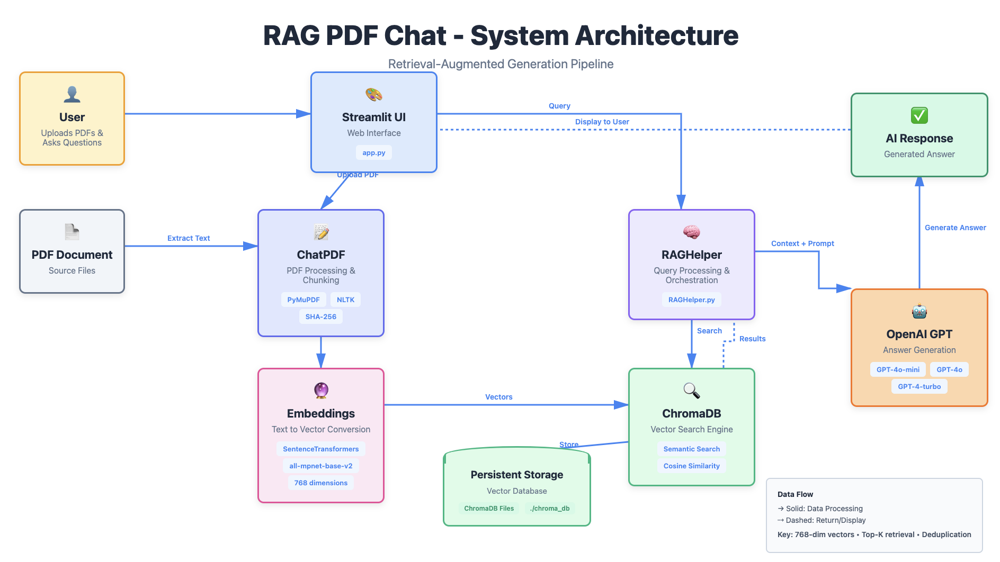

# 📚 RAG PDF Chat Assistant

> **AI-powered PDF chat assistant using RAG (Retrieval-Augmented Generation), ChromaDB vector database, and OpenAI GPT models. Upload your PDFs, ask questions in natural language, and get accurate, source-grounded answers with full transparency into the AI's reasoning process.**

A production-ready application that transforms how you interact with PDF documents. Instead of manually searching through pages, simply ask questions and get intelligent answers backed by your actual document content.

## 🌟 Overview

RAG PDF Chat Assistant is an advanced document intelligence system that combines the power of semantic search with large language models. The application:

- 📄 **Processes PDFs** - Automatically extracts and intelligently chunks text from any PDF document
- 🔍 **Understands Context** - Uses 768-dimensional vector embeddings to understand semantic meaning
- 💾 **Smart Storage** - Stores content in ChromaDB with built-in deduplication to avoid redundancy
- 🤖 **AI-Powered Answers** - Leverages OpenAI's GPT models to generate accurate, contextual responses
- 🔎 **Full Transparency** - Shows you exactly which document sections were used to generate each answer
- ⚡ **Fast & Efficient** - Vector similarity search returns relevant context in milliseconds

Perfect for researchers, students, professionals, and anyone who needs to quickly extract insights from large document collections.

### 💡 Use Cases

- **Research & Academia** - Query research papers, theses, and academic journals
- **Legal & Compliance** - Search through contracts, policies, and legal documents
- **Business Intelligence** - Extract insights from reports, presentations, and whitepapers
- **Education** - Study textbooks and course materials more efficiently
- **Personal Knowledge Management** - Build your personal knowledge base from books and articles

## ✨ Key Features

### 📤 PDF Upload & Processing
- Upload any PDF document through an intuitive web interface
- Automatic text extraction using PyMuPDF
- Intelligent chunking into semantic units (10 sentences per chunk)
- Real-time progress tracking with visual feedback

### 🔐 Smart Deduplication System
- **Content-based detection** using SHA-256 hashing
- **File-level deduplication**: Prevents re-uploading the same document
- **Chunk-level deduplication**: Only stores unique content across all documents
- **Perfect for**:
  - Document revisions (Draft → Review → Final)
  - Document series (Book 1, 2, 3...)
  - Incremental updates (adding new chapters)
- **Results**: ~50% storage reduction for revised documents

> **Note:** Deduplication works for **exact text matches** only. Paraphrased, reformatted, or semantically similar content will be stored as unique. For complex requirements or when changing chunking parameters, use the Reset feature to re-index your entire collection.

### 🔍 Semantic Search
- Vector-based similarity search using SentenceTransformers
- 768-dimensional embeddings (all-mpnet-base-v2 model)
- Configurable top-K retrieval (1-10 results)
- Cosine similarity scoring for relevance

### 🤖 AI-Powered Q&A
- Multiple OpenAI models supported:
  - GPT-4o-mini (fast, cost-effective)
  - GPT-4o (balanced performance)
  - GPT-4-turbo (highest quality)
- Context-aware prompt engineering
- Query expansion for improved recall
- Temperature-controlled generation (0.2 for factual answers)

### 🔎 Transparent AI
- View exact context sent to the AI
- See source chunks with page numbers
- Similarity scores for each retrieved chunk
- Full system/user prompt visibility

### 💾 Persistent Storage
- ChromaDB for vector storage
- Persistent database (./chroma_db)
- Fast retrieval with metadata filtering
- Collection statistics and summaries

### 📊 Real-time Statistics
- Total chunks stored
- Average chunk length
- Number of pages processed
- Embedding dimensions
- Deduplication statistics (new vs. skipped)

## 🏗️ Architecture

### System Diagram



### Data Flow

```
User → Streamlit UI → ChatPDF Processor → Embeddings Engine
                           ↓                      ↓
                    PDF Document            Vector Storage
                           ↓                      ↓
                       Extract Text          ChromaDB
                           ↓                      ↓
                    Chunk & Hash          Persistent Storage
                           ↓                      ↓
                    RAGHelper ← Semantic Search ←┘
                           ↓
                    OpenAI GPT
                           ↓
                    AI Response → Display to User
```

### Component Breakdown

1. **Streamlit UI (app.py)**
   - Web interface for user interactions
   - File upload handling
   - Results visualization
   - Real-time progress tracking

2. **ChatPDF Base (chatpdf_base.py)**
   - PDF text extraction (PyMuPDF)
   - Sentence tokenization (NLTK)
   - Smart chunking (10 sentences)
   - SHA-256 hashing for deduplication
   - ChromaDB integration
   - Collection management

3. **RAGHelper (RAGHelper.py)**
   - Query processing and expansion
   - Context prompt building
   - OpenAI API integration
   - Model selection and configuration
   - Collection statistics

4. **Embedding Engine**
   - SentenceTransformers (all-mpnet-base-v2)
   - 768-dimensional vectors
   - Automatic embedding generation

5. **ChromaDB**
   - Vector similarity search
   - Persistent storage
   - Metadata filtering
   - Cosine similarity scoring

## 🛠️ Tech Stack

| Component | Technology | Purpose |
|-----------|-----------|---------|
| Frontend | Streamlit | Web UI and user interactions |
| Vector DB | ChromaDB | Persistent vector storage |
| Embeddings | SentenceTransformers | Text-to-vector conversion |
| Model | all-mpnet-base-v2 | 768-dim semantic embeddings |
| LLM | OpenAI GPT | Answer generation |
| PDF Processing | PyMuPDF (fitz) | Text extraction |
| Text Processing | NLTK | Sentence tokenization |
| Hashing | hashlib (SHA-256) | Content deduplication |
| Environment | python-dotenv | API key management |
| Data Handling | Pandas | Statistics and display |

## 📦 Installation

### Prerequisites
- Python 3.10 or higher
- OpenAI API key
- 2GB+ RAM recommended

### Step 1: Clone the Repository
```bash
git clone https://github.com/mmariappan/rag-pdf-chat-assistant.git
cd rag-pdf-chat-assistant
```

### Step 2: Create Virtual Environment
```bash
# Create virtual environment
python -m venv venv

# Activate virtual environment
# On macOS/Linux:
source venv/bin/activate

# On Windows:
venv\Scripts\activate
```

### Step 3: Install Dependencies
```bash
pip install -r requirements.txt
```

### Step 4: Set Up Environment Variables
Create a `.env` file in the project root:
```bash
OPENAI_API_KEY=your_openai_api_key_here
TOKENIZERS_PARALLELISM=false
```

### Step 5: Download NLTK Data (Automatic)
The app will automatically download required NLTK data on first run.

### Step 6: Run the Application
```bash
streamlit run app.py
```

The app will open in your browser at `http://localhost:8501`

## 🚀 Quick Start

### 1. Upload Your First PDF
- Click "Upload your PDF file"
- Select any PDF document
- Click "Process PDF"

Expected output:
```
✅ PDF 'document.pdf' processed and stored in ChromaDB!
📊 Processed 50 pages into 250 chunks
✅ ChromaDB has 250 chunks ready for queries.
```

### 2. Ask a Question
- Enter your question in the text box
- Press Enter
- View results:
  - **AI Answer**: Generated response
  - **Source Chunks**: Relevant text with page numbers
  - **Similarity Scores**: Relevance ranking
  - **LLM Context**: What the AI actually saw

### 3. Test Deduplication
Upload the same document again:
```
📋 File 'document.pdf' processed: All 250 chunks already exist in ChromaDB
✅ No duplicates added - your database is up to date!
```

Upload a revised version with new content:
```
✅ PDF 'document_v2.pdf' processed and stored in ChromaDB!
ℹ️ Stored 15 new chunks in ChromaDB collection 'rag_collection'
ℹ️ Skipped 250 duplicate chunks (already in ChromaDB)
```

## 📖 Usage Guide

### Uploading Documents

**Single Document:**
```python
# Upload any PDF file
# System automatically:
# 1. Extracts text
# 2. Chunks into sentences
# 3. Generates embeddings
# 4. Stores in ChromaDB
```

**Multiple Documents:**
```python
# Upload multiple PDFs
# System handles:
# - Cross-document deduplication
# - Unified search across all docs
# - Page number tracking
```

**Document Revisions:**
```python
# Upload Draft → Review → Final
# Only new/changed content is stored
# Original content is automatically detected
```

### Asking Questions

**Simple Questions:**
```
Q: What is the main topic?
A: [AI generates answer from relevant chunks]
```

**Complex Questions:**
```
Q: Compare the approach in Chapter 1 vs Chapter 5
A: [AI synthesizes information from multiple chunks]
```

**Specific Questions:**
```
Q: What was the name of Harry's first broomstick?
A: [AI finds exact reference with page number]
```

### Configuration Options

**Model Selection:**
- `gpt-4o-mini`: Fast, cost-effective (recommended)
- `gpt-4o`: Balanced performance
- `gpt-4-turbo`: Highest quality

**Top-K Retrieval:**
- Range: 1-10 chunks
- Default: 5 chunks
- Higher = more context, slower processing

**Chunk Size:**
- Default: 10 sentences
- Configurable in code
- Larger = more context per chunk

## 🔧 Configuration

### Environment Variables

```bash
# Required
OPENAI_API_KEY=sk-...          # Your OpenAI API key

# Optional
TOKENIZERS_PARALLELISM=false   # Disable tokenizer warnings
```

### Application Settings

Edit in code:

```python
# app.py - Line 151
model_id = st.sidebar.selectbox("Model", [
    "gpt-4o-mini",   # Fast, cheap
    "gpt-4o",        # Balanced
    "gpt-4-turbo"    # Best quality
])

# app.py - Line 152
top_k = st.sidebar.slider("Top K Chunks", 1, 10, 5)

# chatpdf_base.py - Line 141
def chunk_sentences(self, text, max_sentences=10):
    # Adjust chunk size here
```

## 🗂️ Project Structure

```
RAGAppOne/
├── app.py                          # Streamlit web application
├── chatpdf_base.py                 # PDF processing & ChromaDB
├── RAGHelper.py                    # RAG logic & OpenAI integration
├── requirements.txt                # Python dependencies
├── requirements-full.txt           # Complete dependency snapshot
├── packages.txt                    # System packages for deployment
├── .env                           # Environment variables (create this)
├── .gitignore                     # Git ignore rules
├── RAG_PDF_Chat_Architecture.png   # Architecture diagram
├── data/                          # Uploaded PDFs (gitignored)
├── chroma_db/                     # Vector database (gitignored)
├── venv/                          # Virtual environment (gitignored)
└── README.md                      # This file
```

## 🎯 How It Works

### Step 1: PDF Upload & Extraction
```python
# PyMuPDF extracts text from PDF
doc = fitz.open(pdf_path)
for page in doc:
    text = page.get_text()
```

### Step 2: Smart Chunking
```python
# NLTK splits text into sentences
sentences = sent_tokenize(text)

# Group into chunks of 10 sentences
chunks = [' '.join(sentences[i:i+10])
          for i in range(0, len(sentences), 10)]
```

### Step 3: Deduplication Check
```python
# Calculate SHA-256 hash of chunk content
chunk_hash = hashlib.sha256(chunk_text.encode()).hexdigest()

# Check if hash exists in database
if not exists_in_db(chunk_hash):
    store_chunk(chunk)
else:
    skip_duplicate(chunk)

# Note: Hash is based on exact text content
# Even a single character difference = different hash = stored as unique
```

### Step 4: Generate Embeddings
```python
# SentenceTransformers converts text to vectors
embedding = model.encode(chunk_text)  # 768 dimensions
```

### Step 5: Store in ChromaDB
```python
# Store with metadata
collection.add(
    ids=[chunk_hash],
    documents=[chunk_text],
    metadatas=[{"page": page_num, "file_hash": file_hash}],
    embeddings=[embedding]
)
```

### Step 6: Query Processing
```python
# User asks question
query = "What is the main topic?"

# Generate query embedding
query_embedding = model.encode(query)

# Search ChromaDB
results = collection.query(
    query_embeddings=[query_embedding],
    n_results=5  # top_k
)
```

### Step 7: Context Building
```python
# Build context from retrieved chunks
context = "\n\n".join([
    f"Page {r['page']}: {r['text']}"
    for r in results
])

# Create prompt
prompt = f"Context:\n{context}\n\nQuestion:\n{query}\n\nAnswer:"
```

### Step 8: AI Generation
```python
# Send to OpenAI
response = client.chat.completions.create(
    model="gpt-4o-mini",
    messages=[
        {"role": "system", "content": system_instructions},
        {"role": "user", "content": prompt}
    ],
    temperature=0.2
)

answer = response.choices[0].message.content
```

## 🔐 Deduplication System

### How It Works

1. **File-Level Hashing**
   - Calculate SHA-256 of entire PDF
   - Check if file hash exists
   - Skip if already processed

2. **Chunk-Level Hashing**
   - Calculate SHA-256 of chunk text (10 sentences)
   - Check if chunk hash exists in database
   - Store only if unique content

3. **Benefits**
   - No duplicate storage for identical content
   - Faster queries (no duplicate results)
   - Handles document revisions automatically
   - Works across different files

### ⚠️ Important Limitations

**What Deduplication DOES Handle:**
- ✅ Identical documents uploaded multiple times
- ✅ Document revisions with minor changes
- ✅ Document series with overlapping content
- ✅ Incremental updates (e.g., adding new chapters)

**What Deduplication DOES NOT Handle:**
- ❌ **Paraphrased content** - Same meaning, different wording is stored as unique
- ❌ **Translated content** - Same content in different languages
- ❌ **Reformatted text** - Same content with different formatting/line breaks
- ❌ **Chunking changes** - If you modify the chunk size (default: 10 sentences), existing chunks won't be recognized
- ❌ **Semantic duplicates** - Similar concepts expressed differently
- ❌ **Cross-version compatibility** - Chunks created with different chunking algorithms
- ❌ **Minor text variations** - Even a single character difference creates a different hash

### 🔄 When to Reset/Re-index

**Consider resetting your ChromaDB if:**

1. **Changing chunk size** - Modified `max_sentences` parameter
2. **Data quality issues** - Corrupted or inconsistent chunks
3. **Major document updates** - Want to completely refresh all content
4. **Testing different strategies** - Experimenting with different configurations
5. **Storage optimization** - Starting fresh with better organized data

**How to Reset:**

```python
# Option 1: Use the UI
Click "🗑️ Reset ChromaDB" button in the sidebar
Confirm the action

# Option 2: Manual deletion
rm -rf chroma_db/
# Then restart the application
```

> **⚠️ WARNING:** Resetting ChromaDB is **irreversible**. All stored embeddings and chunks will be permanently deleted. You'll need to re-upload and re-process all your documents.

### Example Scenarios

**Scenario 1: Revised Document**
```
Upload: paper_draft.pdf (20 pages, 100 chunks)
Result: ✅ Stored 100 chunks

Upload: paper_final.pdf (22 pages, 110 chunks)
Result: ✅ Stored 10 new chunks
        ℹ️ Skipped 100 duplicate chunks
```

**Scenario 2: Document Series**
```
Upload: book1.pdf (300 pages)
Result: ✅ Stored 1500 chunks

Upload: book2.pdf (320 pages, some recap from book1)
Result: ✅ Stored 1400 new chunks
        ℹ️ Skipped 200 duplicate chunks
```

**Scenario 3: Incremental Updates**
```
Upload: chapters_1-5.pdf
Result: ✅ Stored 500 chunks

Upload: chapters_1-10.pdf (includes 1-5)
Result: ✅ Stored 500 new chunks (chapters 6-10)
        ℹ️ Skipped 500 duplicate chunks (chapters 1-5)
```

## 🌐 Deployment

### Local Deployment

Already covered in Installation section above.

### Streamlit Community Cloud

1. **Push to GitHub**
   ```bash
   git init
   git add .
   git commit -m "Initial commit: RAG PDF Chat Assistant"
   git remote add origin https://github.com/mmariappan/RAGAppOne.git
   git push -u origin main
   ```

2. **Deploy on Streamlit Cloud**
   - Go to [share.streamlit.io](https://share.streamlit.io)
   - Click "New app"
   - Select your GitHub repository
   - Choose `app.py` as the main file
   - Click "Advanced settings"

3. **Add Secrets**
   ```toml
   OPENAI_API_KEY = "your_openai_api_key_here"
   ```

4. **Deploy**
   - Click "Deploy!"
   - Wait for build to complete
   - Your app is live!

### Docker Deployment (Optional)

Create `Dockerfile`:
```dockerfile
FROM python:3.10-slim

WORKDIR /app

COPY requirements.txt .
RUN pip install -r requirements.txt

COPY . .

EXPOSE 8501

CMD ["streamlit", "run", "app.py"]
```

Build and run:
```bash
docker build -t rag-pdf-chat .
docker run -p 8501:8501 -e OPENAI_API_KEY=your_key rag-pdf-chat
```

## 📊 Performance

### Metrics

- **Chunk Processing**: ~50-100 chunks/second
- **Embedding Generation**: ~20-30 chunks/second
- **Query Latency**: <2 seconds (including LLM)
- **Storage**: ~1KB per chunk (including embeddings)
- **Deduplication**: 50-70% storage savings on revisions

### Optimization Tips

1. **Increase chunk size** (more context, fewer chunks)
2. **Reduce top_k** (faster retrieval)
3. **Use gpt-4o-mini** (faster, cheaper)
4. **Batch processing** (process multiple PDFs)

## 🧪 Testing

### Test Deduplication

```python
# Test 1: Same file twice
1. Upload document.pdf
2. Upload document.pdf again
Expected: All chunks skipped

# Test 2: Revised document
1. Upload draft.pdf (100 chunks)
2. Upload final.pdf (110 chunks, includes draft)
Expected: 10 new chunks, 100 skipped

# Test 3: Different files, same content
1. Upload file1.pdf (shared intro)
2. Upload file2.pdf (same intro)
Expected: Duplicate intro chunks skipped
```

### Test Query Quality

```python
# Test with different top_k values
top_k=1  → Very focused, might miss context
top_k=5  → Balanced (recommended)
top_k=10 → More context, might include noise

# Test with different models
gpt-4o-mini  → Fast, good for simple questions
gpt-4o       → Balanced, handles complexity
gpt-4-turbo  → Best quality, slower
```

## 📋 Best Practices

### Database Management

**When to Keep Your Database:**
- Regular document uploads with some overlap
- Adding new chapters to existing books
- Uploading revised versions of documents
- Building a knowledge base incrementally

**When to Reset/Re-index:**
- Changed chunk size in `chatpdf_base.py`
- Want to reorganize your document structure
- Data quality issues or corrupted chunks
- Starting a completely new project
- Need to apply different text processing

### Deduplication Tips

**✅ DO:**
- Upload document revisions - deduplication will handle overlaps
- Upload related documents in a series - shared content is detected
- Trust the deduplication stats shown after upload
- Use the Reset feature when making fundamental changes

**❌ DON'T:**
- Expect deduplication to work for paraphrased content
- Upload differently formatted versions expecting deduplication
- Change chunk size mid-project without resetting
- Rely on deduplication for semantic similarity detection

### Query Optimization

**For Best Results:**
- Start with `top_k=5` (default), adjust based on results
- Use specific questions rather than broad queries
- Try `gpt-4o-mini` first (faster, cost-effective)
- Check source chunks to verify answer quality
- Rephrase questions if results are not satisfactory

## 🐛 Troubleshooting

### Common Issues

**Issue: "OPENAI_API_KEY not found"**
```bash
Solution: Create .env file with your API key
echo "OPENAI_API_KEY=sk-..." > .env
```

**Issue: NLTK download error**
```bash
Solution: Manually download NLTK data
python -c "import nltk; nltk.download('punkt_tab')"
```

**Issue: ChromaDB permission error**
```bash
Solution: Delete and recreate chroma_db folder
rm -rf chroma_db
mkdir chroma_db
```

**Issue: Slow embedding generation**
```bash
Solution: Check CPU usage, consider using GPU
# For GPU support, install:
pip install torch torchvision torchaudio
```

**Issue: Out of memory**
```bash
Solution: Reduce batch size or chunk size
# Edit chatpdf_base.py:
max_sentences=5  # Reduce from 10
```

## 🤝 Contributing

Contributions are welcome! Please:

1. Fork the repository
2. Create a feature branch (`git checkout -b feature/amazing-feature`)
3. Commit your changes (`git commit -m 'Add amazing feature'`)
4. Push to the branch (`git push origin feature/amazing-feature`)
5. Open a Pull Request

### Development Setup

```bash
# Install dev dependencies
pip install -r requirements-full.txt

# Run tests
python -m pytest tests/

# Format code
black *.py
```

## 📄 License

This project is licensed under the MIT License - see below:

```
MIT License

Copyright (c) 2024

Permission is hereby granted, free of charge, to any person obtaining a copy
of this software and associated documentation files (the "Software"), to deal
in the Software without restriction, including without limitation the rights
to use, copy, modify, merge, publish, distribute, sublicense, and/or sell
copies of the Software, and to permit persons to whom the Software is
furnished to do so, subject to the following conditions:

The above copyright notice and this permission notice shall be included in all
copies or substantial portions of the Software.

THE SOFTWARE IS PROVIDED "AS IS", WITHOUT WARRANTY OF ANY KIND, EXPRESS OR
IMPLIED, INCLUDING BUT NOT LIMITED TO THE WARRANTIES OF MERCHANTABILITY,
FITNESS FOR A PARTICULAR PURPOSE AND NONINFRINGEMENT. IN NO EVENT SHALL THE
AUTHORS OR COPYRIGHT HOLDERS BE LIABLE FOR ANY CLAIM, DAMAGES OR OTHER
LIABILITY, WHETHER IN AN ACTION OF CONTRACT, TORT OR OTHERWISE, ARISING FROM,
OUT OF OR IN CONNECTION WITH THE SOFTWARE OR THE USE OR OTHER DEALINGS IN THE
SOFTWARE.
```

## 👤 Author

Built with ❤️ by Mohandas Mariappan

- LinkedIn: [Mohandas Mariappan](https://www.linkedin.com/in/sunmohandas/)
- GitHub: [@mmariappan](https://github.com/mmariappan)

## 🙏 Acknowledgments

- **OpenAI** - For GPT models and API
- **ChromaDB** - For excellent vector database
- **Sentence Transformers** - For semantic embeddings
- **Streamlit** - For beautiful web framework
- **PyMuPDF** - For PDF processing
- **NLTK** - For text tokenization

## 📚 Additional Resources

- [OpenAI API Documentation](https://platform.openai.com/docs)
- [ChromaDB Documentation](https://docs.trychroma.com)
- [SentenceTransformers Documentation](https://www.sbert.net)
- [Streamlit Documentation](https://docs.streamlit.io)
- [RAG Paper (Lewis et al.)](https://arxiv.org/abs/2005.11401)

## 🔮 Future Enhancements

- [ ] Support for multiple file formats (DOCX, TXT, MD)
- [ ] Multi-language support
- [ ] Chat history and conversation memory
- [ ] Custom embedding models
- [ ] Advanced query filters
- [ ] Batch document processing
- [ ] Export/import vector database
- [ ] User authentication
- [ ] Analytics dashboard
- [ ] API endpoint for programmatic access

## 📞 Support

For issues, questions, or suggestions:
- Open an issue on GitHub
- Connect on LinkedIn: [Mohandas Mariappan](https://www.linkedin.com/in/sunmohandas/)

---

**Star ⭐ this repo if you find it helpful!**
