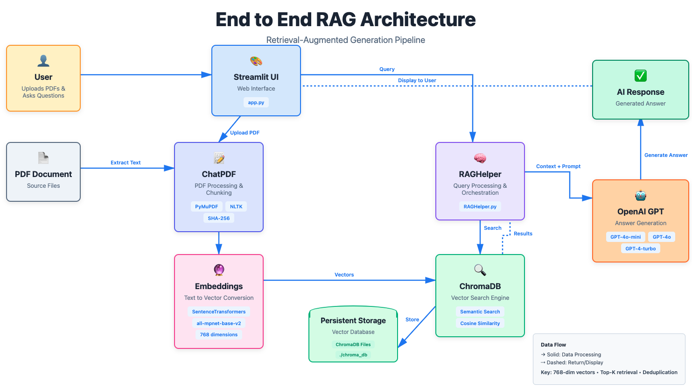

# 📚 End-to-end RAG Architecture

> **AI-powered PDF chat assistant** using Retrieval-Augmented Generation (RAG), ChromaDB, and your choice of LLMs (OpenAI GPT or Ollama open-source models).
> Upload PDFs, ask natural-language questions, and get **accurate, source-grounded answers** with full context visibility.

---

## 📑 Table of Contents

- [Overview](#-overview)
- [Core Features](#-core-features)
- [Architecture](#-architecture)
- [Quick Start](#-quick-start)
- [Next Steps](#-next-steps)
  - [Agentic RAG](#agentic-rag)
  - [Evaluation Framework](#evaluation-framework)
  - [Scaling Strategies](#scaling-strategies)
- [Screenshots](#-screenshots--user-interface-overview)
- [Contributing](#-contributing)
- [License](#-license)
- [Author](#-author)

---

## 🌟 Overview

RAG PDF Chat Assistant combines **semantic search** and **large language models** to help you intelligently query and understand PDF documents.
It extracts, chunks, embeds, and stores document text for fast, context-aware retrieval and question answering.

### Key Highlights

- **PDF Processing** – Text extraction and chunking via PyMuPDF + NLTK
- **Semantic Search** – 768-dim embeddings with SentenceTransformers
- **ChromaDB Storage** – Persistent, deduplicated vector database
- **Dual LLM Support** – Choose between OpenAI GPT or Ollama open-source models
- **AI-Powered Q&A** – Contextual responses from your chosen LLM
- **Transparency** – Shows retrieved chunks and similarity scores
- **Fast** – Retrieves context in milliseconds

---

## ✨ Core Features

<table>
  <tr>
    <td width="50%" valign="top">
      <h3>📤 PDF Upload & Processing</h3>
      <ul>
        <li>Streamlit-based drag-and-drop interface</li>
        <li>Automatic extraction, chunking, and embedding</li>
        <li>Real-time progress and summary statistics</li>
      </ul>
    </td>
    <td width="50%" valign="top">
      <h3>🔐 Smart Deduplication</h3>
      <ul>
        <li>File- and chunk-level SHA-256 hashing</li>
        <li>Avoids duplicate storage across revisions</li>
        <li>Saves 40–60% storage on repeated uploads</li>
      </ul>
    </td>
  </tr>
  <tr>
    <td width="50%" valign="top">
      <h3>🔍 Semantic Search</h3>
      <ul>
        <li>Uses <code>all-mpnet-base-v2</code> embeddings</li>
        <li>Cosine-similarity retrieval (Top-K configurable)</li>
      </ul>
    </td>
    <td width="50%" valign="top">
      <h3>🤖 AI-Powered Q&A</h3>
      <ul>
        <li><strong>OpenAI:</strong> <code>gpt-4o-mini</code>, <code>gpt-4o</code>, <code>gpt-4-turbo</code></li>
        <li><strong>Ollama:</strong> <code>llama3.2</code>, <code>llama3.1</code>, <code>mistral</code>, <code>qwen2.5</code></li>
        <li>Temperature = 0.2 for factual answers</li>
        <li>Automatic context-building and prompt expansion</li>
      </ul>
    </td>
  </tr>
</table>

---

## 🏗️ Architecture



| Component                | Description                          |
| ------------------------ | ------------------------------------ |
| **Streamlit UI**         | Web interface for upload & chat      |
| **ChatPDF Base**         | PDF parsing, chunking, deduplication |
| **RAGHelper**            | Query handling, LLM API calls        |
| **OpenAI / Ollama**      | LLM providers for answer generation  |
| **ChromaDB**             | Vector store for embeddings          |
| **SentenceTransformers** | Generates semantic embeddings        |

---

## 🚀 Quick Start

### 1. Install

```bash
git clone https://github.com/mmariappan/end-to-end-rag-architecture
cd end-to-end-rag-architecture
uv sync
```

### 2. Configure Environment

**For OpenAI (Proprietary):**

Create a `.env` file:

```bash
OPENAI_API_KEY=your_openai_api_key
TOKENIZERS_PARALLELISM=false
```

**For Ollama (Open Source):**

1. Install Ollama: [https://ollama.com/download](https://ollama.com/download) or `brew install ollama`
2. Pull a model: `ollama pull llama3.2:3b`
3. Ollama will start automatically (runs at `http://localhost:11434`)

See [OLLAMA_SETUP.md](OLLAMA_SETUP.md) for detailed Ollama setup instructions.

**Configuration Options:**

- **LLM Provider:** OpenAI or Ollama (selected in UI)
- **OpenAI Models:** `gpt-4o-mini`, `gpt-4o`, `gpt-4-turbo`
- **Ollama Models:** `llama3.2:3b`, `llama3.1:8b`, `mistral:7b`, `qwen2.5:7b`
- **Top-K:** number of chunks to retrieve (default = 5)
- **Chunk Size:** adjustable in `chatpdf_base.py → max_sentences`

### 3. Load Database with PDFs (Python)

Place your PDF files in the `data/` folder and run:

```python
from RAGHelper import RAGHelper

# Initialize RAG helper
rag = RAGHelper(data_dir="data", collection_name="rag_collection")

# Process a PDF
filename = "data/harrypotter.pdf"  # REPLACE with your own data
file_hash = rag.calculate_file_hash(filename)  # avoid duplicates
pages = rag.readPDF(filename)
chunks = rag.processPages_to_sentences(pages)
rag.storeInChromaDB(chunks, file_hash=file_hash, deduplicate_chunks=True)

print(f"Loaded {len(chunks)} chunks into ChromaDB")
```

### 4. Run the App

```bash
uv run streamlit run app.py
```

Visit [http://localhost:8501](http://localhost:8501)

### 5. Using the App

1. **Select LLM Provider** – In the sidebar, choose between:
   - **OpenAI** (requires API key in `.env`)
   - **Ollama (Open Source)** (requires Ollama installed and model pulled)

2. **Upload a PDF** – The app automatically chunks and indexes your document into ChromaDB

3. **Ask Questions** – Type queries like:
   - "Who is the main character introduced in chapter 1?"
   - "Summarize the key points of chapter 3."

4. **Get Contextual Answers** – The system retrieves relevant chunks and uses your chosen LLM to generate accurate, context-aware answers

**Note:** For complete Ollama setup and troubleshooting, see [OLLAMA_SETUP.md](OLLAMA_SETUP.md) or [OPEN_SOURCE_LLM_OPTIONS.md](OPEN_SOURCE_LLM_OPTIONS.md)

---

## 📸 Screenshots & User Interface Overview

Below are the screenshots for a visual walkthrough of the Streamlit app.

<table>
  <tr>
    <td width="50%">
      <b>1. App Home Page</b><br/>
      
    </td>
    <td width="50%">
      <b>2. PDF Upload Screen</b><br/>
      
    </td>
  </tr>
  <tr>
    <td width="50%">
      <b>3. Question & Answer Screen</b><br/>
      
    </td>
    <td width="50%">
      <b>4. What the LLM Sees</b><br/>
      
    </td>
  </tr>
</table>

---

## 🚀 Next Steps

---

### 🤖 1. Agentic RAG

While the current system implements **Traditional RAG**, the next major milestone is to integrate an **Agentic RAG system** with reasoning capabilities.

**Key Features (Planned):**

- **Reasoning-Driven Query Classification** – The system will determine question type (specific vs. summary) before retrieval
- **Dynamic Retrieval Planning** – Choose between narrow retrieval (specific answers) or broad retrieval (summaries)
- **Reflection and Refinement** – After generating a response, the agent reviews it for completeness and automatically re-queries if needed
- **Self-Correction Loop** – The model recognizes insufficient answers and takes a second reasoning pass

**How It Will Work:**

The reasoning cycle will follow this pattern:

```
Query → Retrieve → Generate → Reflect → Refine (if needed) → Re-Retrieve → Final Answer
```

This enables **self-correcting retrieval**, making the AI more aligned with user intent—especially for open-ended or summarization tasks.

---

### 📊 2. Evaluation Framework

After developing the Agentic RAG reasoning module, the focus will be to **evaluate retrieval and generation quality**.

**Objectives:**

- Assess retrieval quality (are retrieved chunks relevant?)
- Evaluate generation accuracy (are answers factually correct and grounded?)
- Quantify reasoning gains (Traditional RAG vs Agentic RAG)

**Evaluation Metrics:**

- **Precision@k / Recall@k** – Evaluate how many of the top-k retrieved chunks are relevant
- **Contextual Relevance (RAGAS)** – Measure contextual fit between query, context, and answer
- **Faithfulness / Groundedness** – Ensure the answer stays within the provided context
- **LLM-as-a-Judge** – Use GPT-4o to evaluate the factuality and fluency of responses

**Tools:** RAGAS, TruLens, LangChain Eval, OpenAI GPT-4o Evaluator

---

### ⚡ 3. Scaling Strategies

Planning to scale the system to handle larger document collections and multi-user deployments.

**Scaling Objectives:**

- Handle larger document collections (tens of thousands of documents or multi-GB corpora)
- Improve query latency through caching and parallelism
- Enable multi-user sessions in shared deployments
- Support distributed storage (transition from local ChromaDB to cloud-hosted vector databases)
- Facilitate horizontal scaling (multiple retrieval or inference workers behind a load balancer)

**Strategies:**

1. **Vector Database Migration** – Move from local ChromaDB to Pinecone, Weaviate, or Milvus for cloud indexing
2. **Containerization & Deployment** – Package services with Docker and deploy to AWS Elastic Beanstalk or ECS
3. **Model Optimization** – Cache embeddings and responses; use smaller models for classification/reflection
4. **Parallel Chunk Ingestion** – Use asynchronous pipelines (Ray, Dask) for faster document embedding
5. **Monitoring & Metrics** – Track query times, retrieval precision, and generation costs

---

## 🤝 Contributing

1. Fork → create a branch → commit changes
2. Run tests (`pytest`) and format with `black *.py`
3. Submit a Pull Request

---

## 📄 License

**MIT License © 2025 Mohandas Mariappan**

---

## 👤 Author

Built by **Mohandas Mariappan**

- [LinkedIn](https://www.linkedin.com/in/sunmohandas/)
- [GitHub @mmariappan](https://github.com/mmariappan)

---

**Star this repo if you find it helpful!**
