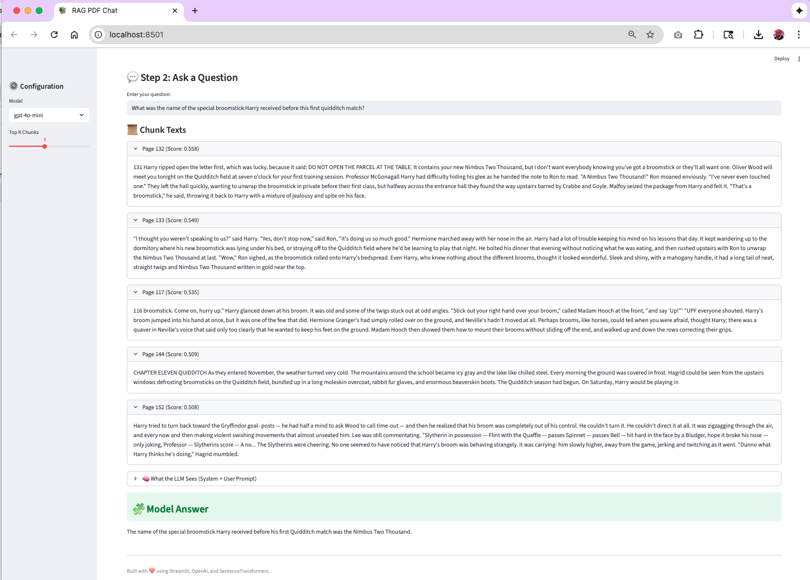

# 📚 End-to-end RAG Architecture

> **AI-powered PDF chat assistant** using Retrieval-Augmented Generation (RAG), ChromaDB, and OpenAI GPT models.
> Upload PDFs, ask natural-language questions, and get **accurate, source-grounded answers** with full context visibility.

---

## 📑 Table of Contents

- [Overview](#-overview)
- [Core Features](#-core-features)
- [Architecture](#-architecture)
- [Quick Start](#-quick-start)
- [Next Steps](#-next-steps)
  - [Agentic RAG](#agentic-rag)
  - [Evaluation Framework](#evaluation-framework)
  - [Scaling Strategies](#scaling-strategies)
- [Screenshots](#-screenshots--user-interface-overview)
- [Contributing](#-contributing)
- [License](#-license)
- [Author](#-author)

---

## 🌟 Overview

RAG PDF Chat Assistant combines **semantic search** and **large language models** to help you intelligently query and understand PDF documents.
It extracts, chunks, embeds, and stores document text for fast, context-aware retrieval and question answering.

### Key Highlights

- **PDF Processing** – Text extraction and chunking via PyMuPDF + NLTK
- **Semantic Search** – 768-dim embeddings with SentenceTransformers
- **ChromaDB Storage** – Persistent, deduplicated vector database
- **AI-Powered Q&A** – Contextual responses from OpenAI GPT models
- **Transparency** – Shows retrieved chunks and similarity scores
- **Fast** – Retrieves context in milliseconds

---

## ✨ Core Features

### PDF Upload & Processing

- Streamlit-based drag-and-drop interface
- Automatic extraction, chunking, and embedding
- Real-time progress and summary statistics

### Smart Deduplication

- File- and chunk-level SHA-256 hashing
- Avoids duplicate storage across revisions
- Saves 40–60% storage on repeated uploads

### Semantic Search

- Uses `all-mpnet-base-v2` embeddings
- Cosine-similarity retrieval (Top-K configurable)

### AI-Powered Q&A

- Models: `gpt-4o-mini`, `gpt-4o`, `gpt-4-turbo`
- Temperature = 0.2 for factual answers
- Automatic context-building and prompt expansion

---

## 🏗️ Architecture


| Component                | Description                          |
| ------------------------ | ------------------------------------ |
| **Streamlit UI**         | Web interface for upload & chat      |
| **ChatPDF Base**         | PDF parsing, chunking, deduplication |
| **RAGHelper**            | Query handling, GPT API calls        |
| **ChromaDB**             | Vector store for embeddings          |
| **SentenceTransformers** | Generates semantic embeddings        |

---

## 🚀 Quick Start

### 1. Install

```bash
git clone https://github.com/mmariappan/rag-pdf-chat-assistant.git
cd rag-pdf-chat-assistant
python -m venv venv && source venv/bin/activate
pip install -r requirements.txt
```

### 2. Configure Environment

Create a `.env` file:

```bash
OPENAI_API_KEY=your_openai_api_key
TOKENIZERS_PARALLELISM=false
```

**Configuration Options:**

- **Model:** choose `gpt-4o-mini`, `gpt-4o`, or `gpt-4-turbo`
- **Top-K:** number of chunks to retrieve (default = 5)
- **Chunk Size:** adjustable in `chatpdf_base.py → max_sentences`

### 3. Run the App

```bash
streamlit run app.py
```

Visit [http://localhost:8501](http://localhost:8501)

### 4. Using the App

1. **Upload a PDF** – The app automatically chunks and indexes your document into ChromaDB
2. **Ask Questions** – Type queries like:
   - "Who is the main character introduced in chapter 1?"
   - "Summarize the key points of chapter 3."
3. **Get Contextual Answers** – The system retrieves relevant chunks and uses GPT to generate accurate, context-aware answers

---

## 📸 Screenshots & User Interface Overview

Below are the screenshots for a visual walkthrough of the Streamlit app.

<table>
  <tr>
    <td width="50%">
      <b>1. App Home Page</b><br/>
      
    </td>
    <td width="50%">
      <b>2. PDF Upload Screen</b><br/>
      
    </td>
  </tr>
  <tr>
    <td width="50%">
      <b>3. Question & Answer Screen</b><br/>
      
    </td>
    <td width="50%">
      <b>4. What the LLM Sees</b><br/>
      
    </td>
  </tr>
</table>

---

## 🚀 Next Steps

---

### 🤖 1. Agentic RAG

While the current system implements **Traditional RAG**, the next major milestone is to integrate an **Agentic RAG system** with reasoning capabilities.

**Key Features (Planned):**

- **Reasoning-Driven Query Classification** – The system will determine question type (specific vs. summary) before retrieval
- **Dynamic Retrieval Planning** – Choose between narrow retrieval (specific answers) or broad retrieval (summaries)
- **Reflection and Refinement** – After generating a response, the agent reviews it for completeness and automatically re-queries if needed
- **Self-Correction Loop** – The model recognizes insufficient answers and takes a second reasoning pass

**How It Will Work:**

The reasoning cycle will follow this pattern:

```
Query → Retrieve → Generate → Reflect → Refine (if needed) → Re-Retrieve → Final Answer
```

This enables **self-correcting retrieval**, making the AI more aligned with user intent—especially for open-ended or summarization tasks.

---

### 📊 2. Evaluation Framework

After developing the Agentic RAG reasoning module, the focus will be to **evaluate retrieval and generation quality**.

**Objectives:**

- Assess retrieval quality (are retrieved chunks relevant?)
- Evaluate generation accuracy (are answers factually correct and grounded?)
- Quantify reasoning gains (Traditional RAG vs Agentic RAG)

**Evaluation Metrics:**

- **Precision@k / Recall@k** – Evaluate how many of the top-k retrieved chunks are relevant
- **Contextual Relevance (RAGAS)** – Measure contextual fit between query, context, and answer
- **Faithfulness / Groundedness** – Ensure the answer stays within the provided context
- **LLM-as-a-Judge** – Use GPT-4o to evaluate the factuality and fluency of responses

**Tools:** RAGAS, TruLens, LangChain Eval, OpenAI GPT-4o Evaluator

---

### ⚡ 3. Scaling Strategies

Planning to scale the system to handle larger document collections and multi-user deployments.

**Scaling Objectives:**

- Handle larger document collections (tens of thousands of documents or multi-GB corpora)
- Improve query latency through caching and parallelism
- Enable multi-user sessions in shared deployments
- Support distributed storage (transition from local ChromaDB to cloud-hosted vector databases)
- Facilitate horizontal scaling (multiple retrieval or inference workers behind a load balancer)

**Strategies:**

1. **Vector Database Migration** – Move from local ChromaDB to Pinecone, Weaviate, or Milvus for cloud indexing
2. **Containerization & Deployment** – Package services with Docker and deploy to AWS Elastic Beanstalk or ECS
3. **Model Optimization** – Cache embeddings and responses; use smaller models for classification/reflection
4. **Parallel Chunk Ingestion** – Use asynchronous pipelines (Ray, Dask) for faster document embedding
5. **Monitoring & Metrics** – Track query times, retrieval precision, and generation costs

---

## 🤝 Contributing

1. Fork → create a branch → commit changes
2. Run tests (`pytest`) and format with `black *.py`
3. Submit a Pull Request

---

## 📄 License

**MIT License © 2025 Mohandas Mariappan**

---

## 👤 Author

Built by **Mohandas Mariappan**

- [LinkedIn](https://www.linkedin.com/in/sunmohandas/)
- [GitHub @mmariappan](https://github.com/mmariappan)

---

**Star this repo if you find it helpful!**
