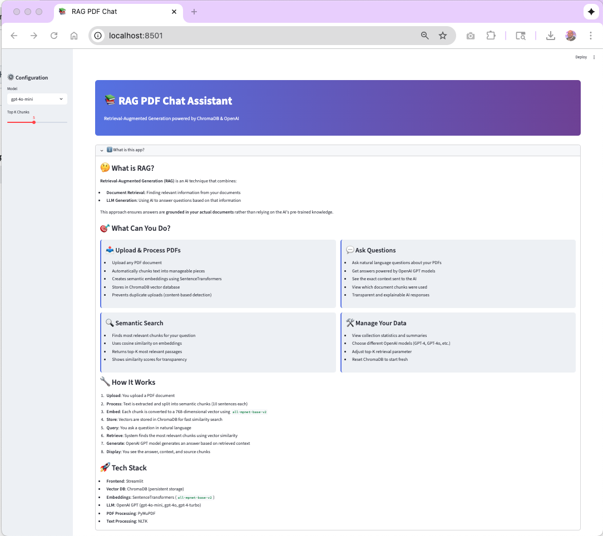

# 📚 RAG PDF Chat Assistant

> **AI-powered PDF chat assistant** using Retrieval-Augmented Generation (RAG), ChromaDB, and OpenAI GPT models.  
> Upload PDFs, ask natural-language questions, and get **accurate, source-grounded answers** — all with full context visibility.

---

## 🌟 Overview

RAG PDF Chat Assistant combines **semantic search** and **large language models** to help you intelligently query and understand PDF documents.  
It extracts, chunks, embeds, and stores document text for fast, context-aware retrieval and question answering.

### Key Highlights

- 📄 **PDF Processing** – Text extraction and chunking via PyMuPDF + NLTK
- 🔍 **Semantic Search** – 768-dim embeddings with SentenceTransformers
- 💾 **ChromaDB Storage** – Persistent, deduplicated vector database
- 🤖 **AI-Powered Q&A** – Contextual responses from OpenAI GPT models
- 🔎 **Transparency** – Shows retrieved chunks and similarity scores
- ⚡ **Fast** – Retrieves context in milliseconds

**Perfect for:** researchers, students, lawyers, analysts, and anyone managing large document collections.

---

## ✨ Core Features

### 📤 PDF Upload & Processing

- Streamlit-based drag-and-drop interface
- Automatic extraction, chunking, and embedding
- Real-time progress and summary statistics

### 🔐 Smart Deduplication

- File- and chunk-level SHA-256 hashing
- Avoids duplicate storage across revisions
- Saves 40–60 % storage on repeated uploads

### 🔍 Semantic Search

- Uses `all-mpnet-base-v2` embeddings
- Cosine-similarity retrieval (Top-K configurable)

### 🤖 AI-Powered Q&A

- Models: `gpt-4o-mini`, `gpt-4o`, `gpt-4-turbo`
- Temperature = 0.2 for factual answers
- Automatic context-building and prompt expansion

---

## 🏗️ Architecture


| Component                | Description                          |
| ------------------------ | ------------------------------------ |
| **Streamlit UI**         | Web interface for upload & chat      |
| **ChatPDF Base**         | PDF parsing, chunking, deduplication |
| **RAGHelper**            | Query handling, GPT API calls        |
| **ChromaDB**             | Vector store for embeddings          |
| **SentenceTransformers** | Generates semantic embeddings        |

---

## 🚀 Quick Start

### 1️⃣ Install

```bash
git clone https://github.com/mmariappan/rag-pdf-chat-assistant.git
cd rag-pdf-chat-assistant
python -m venv venv && source venv/bin/activate
pip install -r requirements.txt
```

### 2️⃣ Configure Environment

Create a `.env` file:

```bash
OPENAI_API_KEY=your_openai_api_key
TOKENIZERS_PARALLELISM=false
```

---

## 🧠 Configuration

- **Model:** choose `gpt-4o-mini`, `gpt-4o`, or `gpt-4-turbo`
- **Top-K:** number of chunks to retrieve (default = 5)
- **Chunk Size:** adjustable in `chatpdf_base.py → max_sentences`

---

## 🌐 Deployment

### Streamlit Cloud

1. Push repo to GitHub
2. Go to [share.streamlit.io](https://share.streamlit.io) → “New app”
3. Choose `app.py` as entry point
4. Add secret:
   ```toml
   OPENAI_API_KEY = "your_openai_api_key"
   ```

### Docker (optional)

```dockerfile
FROM python:3.10-slim
WORKDIR /app
COPY . .
RUN pip install -r requirements.txt
EXPOSE 8501
CMD ["streamlit", "run", "app.py"]
```

Run:

```bash
docker build -t rag-pdf-chat .
docker run -p 8501:8501 -e OPENAI_API_KEY=your_key rag-pdf-chat
```

---

## 🚀 Next Steps:

## 1. Agentic RAG System with Reasoning

While the current system implements **Traditional RAG**, the **next major milestone** will be to design and integrate an **Agentic RAG system**.

This future enhancement will allow the AI model not only to retrieve and generate responses, but also to **think, reflect, and refine** its queries dynamically.

---

### ✳️ Key Features (Planned)

| Capability                                | Description                                                                                                                                                       |
| ----------------------------------------- | ----------------------------------------------------------------------------------------------------------------------------------------------------------------- |
| **Reasoning-Driven Query Classification** | The system will first determine the _type_ of question (specific vs. summary) before deciding how to retrieve data.                                               |
| **Dynamic Retrieval Planning**            | The model will choose whether to perform narrow retrieval (specific answers) or broad retrieval (summaries).                                                      |
| **Reflection and Refinement**             | After generating a response, the agent will review it for completeness and accuracy, and—if needed—automatically re-query the database with an improved question. |
| **Multi-Section Summarization**           | For summary-type questions, the agent will summarize sections or chapters iteratively and merge insights.                                                         |
| **Self-Correction Loop**                  | The model will learn to recognize when its first answer was insufficient and take a second reasoning pass.                                                        |

---

### 🧩 Agentic RAG Architecture (Planned)

```text
User Query
   │
   ▼
[AgentRAG] ──► Classify ──► Retrieve/Summarize ──► Reflect ──► Refine ──► Final Answer
             │                  │                     │
             │                  └── Uses RAGHelper + ChromaDB
             └── Powered by GPT-4o Reasoning
```

---

### 🧠 How It Will Work

#### 1.1 Query Classification

When a user asks a question, the system will first send it to GPT-4o to determine intent:

- **Specific Query**: Requests a fact or explanation.  
  Example: “What is the total enrollment of the school?”
- **Summary Query**: Requests an overview or synthesis.  
  Example: “Summarize the performance trends across all grades.”

This classification step will output JSON like:

```json
{ "type": "specific" }
```

or

```json
{ "type": "summary" }
```

The chosen type will drive how the retrieval step works.

---

#### 1.2. Reflection and Refinement

After producing an initial answer, the model will _evaluate its own output_ using GPT-4o reasoning.  
 The evaluation prompt will ask GPT-4o whether the answer is complete and if it should refine the query.

It might respond like this:

```json
{
  "complete": false,
  "refined_query": "Summarize chapter 3 focusing on the conflict between characters."
}
```

If the response is incomplete, the agent will automatically run a second retrieval with the refined query, generating a more comprehensive answer.

---

#### 1.3. Iterative Reasoning Loop

The reasoning cycle will follow this pattern:

```
Query → Retrieve → Generate → Reflect → Refine (if needed) → Re-Retrieve → Final Answer
```

This enables **self-correcting retrieval**, making the AI more aligned with user intent—especially for open-ended or summarization tasks.

---

### 💡 Example Scenario

**User query:**

> “Summarize chapter 5.”

**First answer:**

> “It discusses friendship and courage.”

**Reflection step:**  
 GPT-4o realizes the answer lacks depth and returns:

```json
{
  "complete": false,
  "refined_query": "Summarize chapter 5 focusing on friendship, courage, and betrayal."
}
```

**Second retrieval:**

> “Chapter 5 explores friendship, courage, and betrayal, highlighting how trust is tested between key characters.”

✅ The refined output is richer and more aligned with context.

---

## 🧪 2. Evaluation Framework for RAG Systems

After developing the Agentic RAG reasoning module, the next focus will be to **evaluate retrieval and generation quality**.  
The goal is to measure how well the system finds relevant information and how accurately it answers based on that context.

---

### 🎯 Objectives of Evaluation

| Goal                                  | Description                                                                            |
| ------------------------------------- | -------------------------------------------------------------------------------------- |
| **2.1. Assess Retrieval Quality**     | Measure whether retrieved chunks are relevant to the user’s query.                     |
| **2.2. Evaluate Generation Accuracy** | Determine if generated answers are factually correct and grounded in retrieved data.   |
| **2.3. Quantify Reasoning Gains**     | Compare traditional RAG vs Agentic RAG in terms of completeness and factual alignment. |

---

### 🧩 Evaluation Metrics

| Metric                           | Purpose                                                         | Example Usage                                                         |
| -------------------------------- | --------------------------------------------------------------- | --------------------------------------------------------------------- |
| **Precision@k / Recall@k**       | Evaluate how many of the top-k retrieved chunks are relevant.   | Precision@3 = % of top 3 retrieved chunks that truly answer the query |
| **Contextual Relevance (RAGAS)** | Measure contextual fit between query, context, and answer.      | “Did the model use retrieved context correctly?”                      |
| **Faithfulness / Groundedness**  | Ensure the answer stays within the provided context.            | Penalize hallucinations                                               |
| **Answer Completeness**          | Evaluate whether the answer covers all key aspects.             | Completeness score from human or model evaluation                     |
| **LLM-as-a-Judge**               | Use GPT-4o to evaluate the factuality and fluency of responses. | GPT rates answers on a 1–5 factual scale                              |

---

### 🧠 Tools and Frameworks

| Tool                                                              | Description                                                                 |
| ----------------------------------------------------------------- | --------------------------------------------------------------------------- |
| **RAGAS** ([GitHub](https://github.com/explodinggradients/ragas)) | Framework to automatically evaluate RAG pipelines (retrieval + generation). |
| **LangChain Eval**                                                | Built-in RAG evaluation with chain comparison support.                      |
| **TruLens** ([trulens.org](https://www.trulens.org/))             | Provides trace-level evaluation for RAG pipelines and agentic loops.        |
| **OpenAI GPT-4o Evaluator**                                       | Use GPT-4o as a reflection-based evaluator to score responses.              |

---

### ⚙️ Planned Evaluation Pipeline

```text
Dataset of queries
   │
   ▼
[Retrieval] ─► Evaluate Precision / Recall / RAGAS
   │
   ▼
[Generation] ─► Evaluate Faithfulness / Completeness / Fluency
   │
   ▼
[Comparison] ─► Traditional RAG vs Agentic RAG
```

---

### 🔍 Example Evaluation Workflow (Future)

1. **Prepare a benchmark dataset** of question–answer pairs.
2. **Run both systems** (Traditional RAG and Agentic RAG) on the same dataset.
3. **Compute retrieval metrics** using RAGAS or a custom scorer.
4. **Evaluate generation quality** using GPT-4o as a judge.
5. **Aggregate results** to identify accuracy and reasoning improvements.

---

### 📊 Sample Evaluation Criteria

| Criterion                      | Traditional RAG | Agentic RAG (Expected) |
| ------------------------------ | --------------- | ---------------------- |
| Faithfulness                   | 0.78            | 0.92                   |
| Completeness                   | 0.65            | 0.90                   |
| Response Fluency               | 0.88            | 0.93                   |
| Query Refinement Effectiveness | —               | +25%                   |

### 🚀 3. Scaling Objectives

| Goal                                        | Description                                                                                              |
| ------------------------------------------- | -------------------------------------------------------------------------------------------------------- |
| **3.1. Handle Larger Document Collections** | Optimize embeddings, indexing, and storage to handle tens of thousands of documents or multi-GB corpora. |
| **3.2. Improve Query Latency**              | Reduce retrieval and reasoning response times through caching and parallelism.                           |
| **3.3. Enable Multi-User Sessions**         | Manage isolated user sessions in shared deployments (e.g., Streamlit Cloud, AWS, or GCP).                |
| **3.4. Support Distributed Storage**        | Transition from local ChromaDB to cloud-hosted vector databases (Pinecone, Weaviate, Milvus).            |
| **3.5. Facilitate Horizontal Scaling**      | Deploy multiple retrieval or inference workers behind a load balancer.                                   |

---

### 🧩 Planned Scaling Architecture

```text
User Query
   │
   ▼
[Frontend: Streamlit / Angular]
   │
   ▼
[Backend: FastAPI or Node.js]
   │
   ├──► Retrieval Service (RAGHelper instances) ─► Vector DB (Pinecone / Chroma Cloud)
   ├──► Reasoning Service (GPT-4o or local model)
   └──► Evaluation Dashboard (RAGAS / Streamlit / W&B)
```

---

### ⚙️ Scaling Strategies

1. **Vector Database Migration**

   - Move from local ChromaDB → Pinecone, Weaviate, or Milvus for cloud indexing.
   - Benefit: faster retrieval, high availability, built-in redundancy.

2. **Containerization & Deployment**

   - Package services with Docker and deploy to AWS Elastic Beanstalk or ECS.
   - Enable auto-scaling based on load.

3. **Model Optimization**

   - Cache embeddings and responses.
   - Optionally use smaller models (e.g., GPT-4o-mini) for classification/reflection.

4. **Parallel Chunk Ingestion**

   - Use asynchronous pipelines (e.g., Ray, Dask) for faster document embedding and loading.

5. **Monitoring & Metrics**
   - Track query times, retrieval precision, and generation costs.
   - Integrate with Weights & Biases, Prometheus, or AWS CloudWatch.

---

### 💡 Long-Term Scaling Vision

- **Multi-Tenant SaaS Model:** Allow multiple organizations to upload and query their own document sets.
- **Serverless Functions:** Offload reflection and summarization tasks to AWS Lambda or GCP Cloud Run.
- **Global Caching Layer:** Use CDN + Redis for low-latency retrieval results.
- **Adaptive Cost Optimization:** Dynamically switch between GPT-4o-mini and GPT-4o based on question complexity.

---

### 3️⃣ Run the App

```bash
streamlit run app.py
```

## Visit [http://localhost:8501](http://localhost:8501)

## 💬 Using the App

1. **Upload a PDF**  
   The app automatically chunks and indexes your document into ChromaDB or CSV.

2. **Ask Questions**  
   Type a query like:

   - “Who is the main character introduced in chapter 1?”
   - “Summarize the key points of chapter 3.”

3. **Get Contextual Answers**  
   The system retrieves the most relevant document chunks and uses GPT to generate accurate, context-aware answers.

---

## 📸 Screenshots & User Interface Overview

Below are the screenshots for a visual walkthrough of the Streamlit app.

### 🏠 1.App Home Page



### 📄 2. PDF Upload Screen


### 💬 3. Question & Answer Screen


### 💬 4. What the LLM Sees


---

## 🤝 Contributing

1. Fork → create a branch → commit changes
2. Run tests (`pytest`) and format with `black *.py`
3. Submit a Pull Request 🚀

---

## 📄 License

**MIT License © 2024 Mohandas Mariappan**

---

## 👤 Author

Built with ❤️ by **Mohandas Mariappan**

- 💼 [LinkedIn](https://www.linkedin.com/in/sunmohandas/)
- 🌐 [GitHub @mmariappan](https://github.com/mmariappan)

---

**⭐ Star this repo if you find it helpful!**
